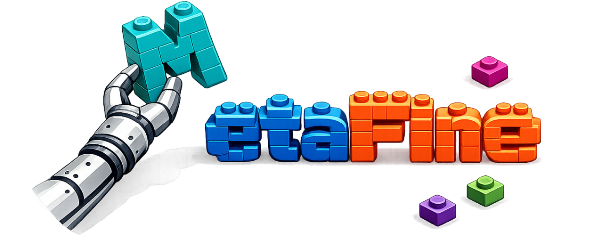
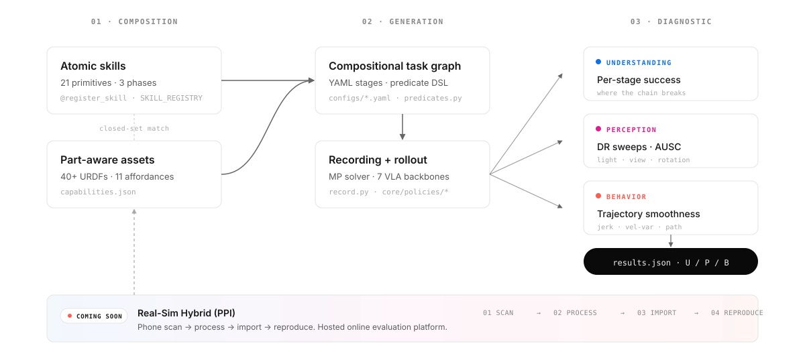

<div align="center">



# MetaFine

**A diagnostic evaluation framework for fine-grained robotic manipulation.**

[](https://metafine.github.io)
[](https://www.modelscope.cn/datasets/hiangx/MetaFine)
[](https://huggingface.co/datasets/hiangx/MetaFine)

[](https://www.python.org/)
[](https://sapien.ucsd.edu/)
[](https://github.com/haosulab/ManiSkill)
[](#license)
[](#timeline)

</div>

---

MetaFine treats evaluation as a tool for **scientific diagnosis** rather than a leaderboard. Instead of collapsing a manipulation policy into a single binary success rate, MetaFine disentangles capability into three fundamental dimensions — **understanding**, **perception**, and **behavior** — and surfaces the hidden failure modes that conventional benchmarks miss.

The platform is built on a **compositional task graph** and an **extensible asset library** so it can generate diverse fine-grained tasks, absorb heterogeneous benchmarks, and support both pure simulation and hybrid real–sim evaluation.

> 📖 **Full documentation**, tutorials, and the supported policies / tasks catalogue live on the [project homepage](https://metafine.github.io). This README covers what the *codebase* is, how to install it, and how it fits together.

## ✨ Features

| | | |
|:---|:---|:---|
| **🔬 Three-dimensional diagnosis** | **🧩 Atomic compositional skills** | **🧱 Fine-grained part-aware assets** |
| Evaluate <em>understanding · perception · behavior</em> separately to expose hidden failure modes — not a single binary success rate. | Compose arbitrary fine-grained tasks from 21 reusable atomic primitives + an 11-element affordance closed set. | 40+ part-annotated articulated objects with auto-derived `capabilities.json` and a CLI for rapid asset expansion. |
| **🌐 Real-sim hybrid (PPI)** | **📦 Drop-in install** | **🤖 Built-in agent + skill library** |
| Bridge simulation and reality with phone-scan → process → import → reproduce; same diagnostic protocol on both sides. | One command: `pip install -e .`. Per-policy VLA stacks install separately so dependency hells stay contained. | Two Claude Code skills (`metafine_help`, `metafine_add`) automate platform Q&A and new skill/task authoring. |

## ⚡ TL;DR

- **Diagnostic, not binary.** Every eval produces a `results.json` with three orthogonal scores (per-stage success / DR-AUSC / action-smoothness) — not just `success_rate=0.42`.
- **Compositional skills.** 21 affordance-typed atomic skills (grasp, rotate, slide, insert, …) compose into multi-step task graphs via YAML or Python. Adding a long-horizon task is a 30-line YAML, not a new env class.
- **Plays well with VLAs.** A shared data pipeline (record → merge → replay → convert) feeds LeRobot and RLDS exports. Seven backbones are vendored (ACT / DP3 / OpenVLA / OpenVLA-OFT / π0 / π0.5 / StarVLA); training is verified via the **LeRobot** and **StarVLA** paths, and **π0.5** closed-loop inference is verified.

---

## 🤖 Built-in skills (Claude Code)

MetaFine ships two [Claude Code](https://claude.com/claude-code) skills that drop into `~/.claude/skills/` and accelerate everyday work on the platform:

| Skill | Invoke | What it does |
|---|---|---|
| **`metafine_help`** | `/metafine_help <question>` | Routes a natural-language question to the relevant user-guide section, optionally consults the live codebase, and returns a tight 5–15 line answer with a `→ See:` source citation. Strictly read-only. |
| **`metafine_add`** | `/metafine_add <description>` | Designs a new MetaFine artifact — either a new atomic skill (`@register_skill` stub) or a new compositional task graph YAML. Walks phase classification, affordance contract, predicate composition, validation, and writes the file *only on confirmation*. |

Install: drop the skill directories into `~/.claude/skills/metafine_help/` and `~/.claude/skills/metafine_add/`. Both skills work with the upstream MetaFine user guide as their primary knowledge base. See [`docs/agents.md`](docs/agents.md) for the full design.

---

## Why MetaFine?

Conventional benchmarks ask one question: *did the policy succeed?* A yes/no answer hides which part of the system failed. MetaFine's premise is that any meaningful evaluation has to answer three questions simultaneously:

| Dimension | The question it answers | How MetaFine measures it |
|---|---|---|
| **Understanding** | Did the policy know *what to do, in the right order*? | **Per-stage success rates** over a multi-step task graph — surfaces *where* the chain breaks (engagement → manipulation → release). |
| **Perception** | Did the policy correctly process its sensory inputs *under variation*? | **Domain-randomisation sweeps** with **AUSC** (area-under-success-curve) for lighting, camera pose, and camera rotation — a normalised 0-to-1 score per axis. |
| **Behavior** | Did the policy execute its plan *smoothly*? | **Action-trajectory smoothness** (jerk RMS, velocity variance, path length) — exposes jerky, hesitant, or chunk-of-N-artefact policies that still happen to "succeed". |

Two policies with the same headline success rate can have totally different `results.json` profiles. MetaFine is designed to make that difference visible.

---

## 📢 What's New

<sub>Latest at top.</sub>
- **2026-05-15** &nbsp; 
  &nbsp; 🤖 **Built-in Claude Code skills shipped.**
  Two slash commands land alongside the platform: [`/metafine_help`](https://metafine.github.io/user_guide/agents/help.html) routes natural-language
  questions to the user guide; [`/metafine_add`](https://metafine.github.io/user_guide/agents/add.html) walks you through designing a new atomic skill
  or task graph with phase / affordance / predicate validation.
  
- **2026-05-14** &nbsp; 
  &nbsp; 🚀 **MetaFine v0.1 — public open-source release.**
  19 envs · 21 atomic skills · 11-affordance closed set · 40+ part-aware assets · three-dimension
  diagnostic eval (U / P / B) · 7 vendored VLA backbones (training verified via LeRobot + StarVLA) ·
  LeRobot + RLDS exports · editable install via `pip install -e .`. See the [user guide](https://metafine.github.io/user_guide/) for the full tour.
  
## 🧭 How it works

MetaFine sits on a three-layer pipeline. **Composition** brings together atomic skills + part-aware assets via a closed-set affordance match. **Generation** turns that algebra into compositional task graphs that drive recording and rollout. **Diagnostic** scores every rollout along the three orthogonal axes.

<p align="center">
  
</p>

Every concept maps onto something concrete in the source tree:

- **Atomic skills** — `core/skill.py` (21 motion-planning primitives, `@register_skill` decorator).
- **Part-aware assets** — `assets/<id>/{urdf.xml, capabilities.json, model_data.json}` (40+ articulated objects with declared affordances).
- **Task graphs** — `configs/*.yaml`, executed by `utils/task_graph.py`; predicates compile via `core/predicates.py`.
- **Rollout** — `record.py` for expert demonstrations (MP solver); `core/policies/*` for VLA backbones.
- **Diagnostic** — `utils/eval_metrics.py` (smoothness), `utils/eval_sweep.py` (DR + AUSC), `utils/eval_setup.py` (env dispatch).

---

## 📦 Installation

### System requirements

| Component | Required |
|---|---|
| OS | Linux (Ubuntu 20.04 / 22.04 tested) |
| GPU | NVIDIA, ≥ 8 GB VRAM (CUDA 11.8 or 12.x) |
| Python | 3.10 or 3.11 |
| Disk | ~3 GB for code + assets; per-policy checkpoints separate |

### Quick install

```bash
# 1. (Recommended) fresh conda env
conda create -n metafine python=3.10 -y
conda activate metafine

# 2. Clone + editable install
git clone https://github.com/Hiangx-robotics/MetaFine.git
cd metafine
pip install -e .
```

That's it for the simulation core. Verify the install:

```bash
python -c "import core.env, core.skill; import gymnasium as gym; \
           env = gym.make('grasp_part'); \
           print('Ready:', type(env.unwrapped).__name__); env.close()"
# → Ready: GraspPartEnv
```

### Optional extras

```bash
pip install -e ".[ai]"     # + openai client (used by the AI-planner path)
pip install -e ".[dev]"    # + pytest for running the test suite
```

### Assets

The 40+ part-annotated articulated objects (PartNet-Mobility subset + custom URDFs) and example task-graph configs are distributed as a separate dataset to keep the source repo small. Download from either mirror:

- 🤖 **ModelScope** — `modelscope download --dataset hiangx/MetaFine`
- 🤗 **Hugging Face** — `huggingface-cli download hiangx/MetaFine --repo-type dataset`

Place the unpacked `assets/` and `configs/` next to the repo root. Detailed asset onboarding (capability auto-derivation, the review CLI, the schema for `capabilities.json` / `model_data.json`) is in the user guide.

### Per-policy installs (VLA stacks)

Each VLA backbone is a separately-installable subdirectory with its own dependency set — π0 and OpenVLA pin conflicting `torch` / `transformers` versions, so MetaFine deliberately does *not* roll them into the core install. Pick the one you need:

```bash
pip install -e core/policies/pi05        # π0.5
pip install -e core/policies/openvla     # OpenVLA
pip install -e core/policies/openvla-oft # OpenVLA-OFT
# ... see core/policies/<name>/README.md for the rest
```

---

## 🚀 Quickstart

The end-to-end pipeline: **record → merge → replay → convert → train → evaluate**. Full tutorials on the [project homepage](https://metafine.github.io/user_guide/).

```bash
# 1. Record expert demos — single skill, or --task-graph for a multi-stage env
python record.py -e grasp_part --object-name 100221 --part-name cap -n 5 --only-count-success
python record.py --task-graph configs/example_grasp_cap.yaml -n 5

# 2. Merge raw shards into one trajectory
python utils/merge_trajectory.py -i demos/grasp_part/100221 \
    -o demos/grasp_part/100221/trajectory.h5 -p trajectory.h5

# 3. Replay to render observations (output name encodes obs.control.backend)
python utils/replay_trajectory.py --traj-path demos/grasp_part/100221/trajectory.h5 \
    -o rgb -c pd_joint_delta_pos -b physx_cpu --use-first-env-state --save-traj --save-video
# → trajectory.rgb.pd_joint_delta_pos.physx_cpu.h5

# 4. Convert for training — LeRobot, or convert_to_rlds for OpenVLA
python utils/convert_to_lerobot.py \
    --traj-path demos/grasp_part/100221/trajectory.rgb.pd_joint_delta_pos.physx_cpu.h5 \
    --output-dir demos/grasp_part/lerobot_grasp_part \
    --task-name "Grasp the cap of the bottle." --fps 30 --robot-type panda

# 5. Train via the LeRobot or StarVLA pipeline (see user guide)

# 6. Evaluate the trained checkpoint closed-loop in the simulator (π0.5 example)
python core/policies/pi05/evaluate.py \
    --policy-path /path/to/pretrained_model --env-id grasp_part \
    --object-name 100221 --part-name cap --obs-mode rgb \
    --control-mode pd_joint_delta_pos --n-episodes 50 \
    --device cuda --task "Grasp the cap of the bottle." --save-video
```

Each backbone's exact flags are in its own `core/policies/<name>/README.md`. There is no universal `--task-graph` eval adapter; per-policy `evaluate.py` scripts are standalone.

---


## 🗂️ Project layout

```
metafine/
├── core/
│   ├── env.py                 # 19 Gym envs (single-skill + bundle)
│   ├── skill.py               # 21 motion-planning skill solvers
│   ├── scene.py               # SceneBuilders (data-driven, no per-asset branches)
│   ├── skill_registry.py      # @register_skill + affordance metadata
│   ├── predicates.py          # success-DSL compiler
│   ├── env_mixins.py          # EvalDREnvMixin (camera/light jitter)
│   ├── motion.py              # MP solver helpers
│   └── policies/              # vendored VLA stacks — installed separately
│       ├── act/  dp3/  pi0/  pi05/  openvla/  openvla-oft/  starvla/
├── utils/
│   ├── task_graph.py          # TaskGraph dataclass + YAML loader + runner
│   ├── eval_setup.py          # make_eval_env (single-skill ↔ task-graph dispatch)
│   ├── eval_metrics.py        # EpisodeResult / EvalSummary / smoothness
│   ├── eval_sweep.py          # dr_sweep + standard_dr_sweeps with AUSC
│   ├── derive_capabilities.py # URDF → capabilities.json auto-derivation
│   └── review_capabilities.py # interactive CLI for capabilities QA
├── assets/                    # distributed separately — see Installation
├── configs/                   # example task-graph YAMLs
├── docs/                      # logo + architecture diagram + agent design notes
├── robots/                    # Franka URDF + robot.py
├── record.py                  # demo recorder (single-skill + --task-graph mode)
├── pyproject.toml
└── README.md
```

---


## 🗓️ On the roadmap
— &nbsp; 🧠 **AI planner.** Natural-language → task-graph YAML; LLM proposes stages, the validator gates them, you review.
— &nbsp; 🏆 **Hosted PPI evaluation platform + public leaderboard.** Upload phone scan + policy checkpoint; get a unified `results.json` against the public board. Sim / real / hybrid scores side by side.
— &nbsp; 👋 **Multi-modal observations.** Tactile · force/torque · audio. Real-robot parity adapter for drop-in Franka / xArm deployment.

## 🤝 Contributing

This project is in **active alpha** development; APIs may break between releases. The general workflow:

- Branch from `main` as `feature/<short-name>` or `refactor/<short-name>`.
- Run `python smoke_envs.py` before opening a PR — every commit should leave the 19 envs loadable.
- Keep commits scoped (one phase per commit), and follow the existing imperative-mood commit-message style.
- For larger changes (new skills, new affordances, new policies), open a discussion on the project homepage first so the affordance vocabulary and registry stay coherent.

Full contributor guide and code-style conventions: see the user guide.

---

## 📑 Citation

A paper describing MetaFine is in preparation. A BibTeX entry will be added here once it is public.

```bibtex
@misc{metafine2026,
  title  = {Beyond Binary Success: A Diagnostic Meta-Evaluation Framework for Fine-Grained Manipulation},
  author = {Coming soon},
  year   = {2026},
  note   = {In preparation}
}
```

---

## 🙏 Acknowledgments

MetaFine builds on the shoulders of several superb open-source projects:

- [**SAPIEN**](https://sapien.ucsd.edu/) and [**ManiSkill**](https://github.com/haosulab/ManiSkill) — physics simulator and benchmark backbone.
- [**PartNet-Mobility**](https://sapien.ucsd.edu/browse) — the articulated-object corpus most of our assets are drawn from.
- [**LeRobot**](https://github.com/huggingface/lerobot) — episode-format and policy-training tooling.
- The authors and maintainers of **ACT**, **Diffusion Policy / DP3**, **OpenVLA / OpenVLA-OFT**, **π0 / π0.5**, and **StarVLA** for releasing reproducible policy code.

---

## 📄 License

Released under the **MIT License**. See the [LICENSE](LICENSE) file for details. Note that vendored VLA stacks under `core/policies/*` retain their own upstream licenses — consult each subdirectory before redistribution.
